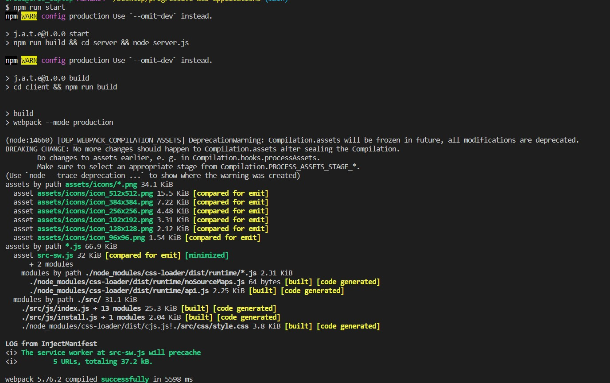
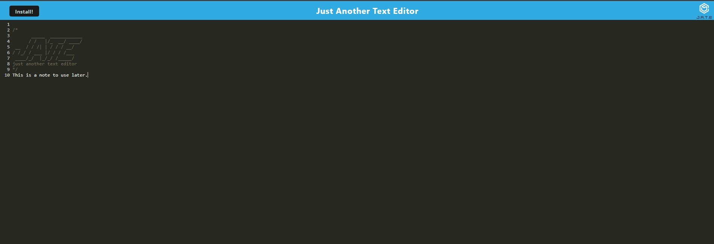
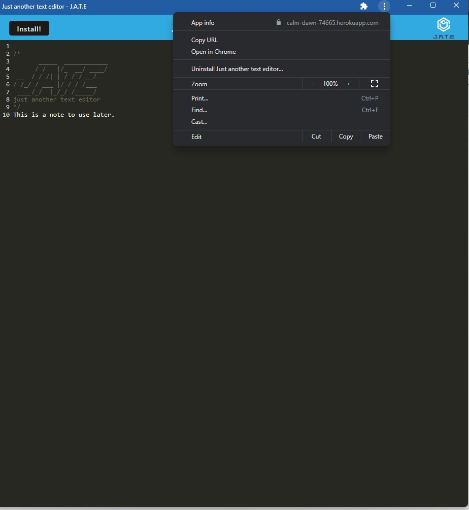

# 19 Progressive Web Applications (PWA): Text Editor

Table of contents

  - [About the project](#abouttheproject)
  - [Installation](#installation)
  - [description](#description)
  - [Usage](#usage)
  - [Credits](#credits)
  - [license](#license)

## About the project ##

This project is built to create notes or code snippets with or without an internet connection as a native application, working with internet connection or offline, so the user can make notes and still be saved or being able to delete them based on his needs.
This text editor application uses workbox, and manifest file, concurrency, express and webpack in order to work off line and save the notes created by the user.

## Installation ##

In order to be able to use this app, the user needs to install the following packages in a package.json file using the command line `npm init` and add in dependencies this packages:
`"devDependencies": {
    "@babel/core": "^7.15.0",
    "@babel/plugin-transform-runtime": "^7.15.0",
    "@babel/preset-env": "^7.15.0",
    "@babel/runtime": "^7.15.3",
    "babel-loader": "^8.2.2",
    "css-loader": "^6.2.0",
    "html-webpack-plugin": "^5.3.2",
    "http-server": "^0.11.1",
    "style-loader": "^3.2.1",
    "webpack": "^5.51.1",
    "webpack-cli": "^4.8.0",
    "webpack-dev-server": "^4.0.0",
    "webpack-pwa-manifest": "^4.3.0",
    "workbox-webpack-plugin": "^6.2.4"
  },
  "dependencies": {
    "code-mirror-themes": "^1.0.0",
    "idb": "^6.1.2"
  }` 
 Once the user has the necessary packages to be able to use this app, using in the command line `npm run start`.

 ## Description

 To build this text editor that runs in the browser, The app will be a single-page application that meets the PWA criteria. Additionally, it will feature a number of data persistence techniques that serve as redundancy in case one of the options is not supported by the browser. The application will also function offline.To build this text editor, the user will start with an existing application and implement methods for getting and storing data to an IndexedDB database. The user will use a package called idb, which is a lightweight wrapper around the IndexedDB API. It features a number of methods that are useful for storing and retrieving data, and is used by companies like Google and Mozilla.

 ## Usage ##
 This app can be used with access to internet or off line and can save data in both states, also it can be installed in the computer to have it locally and use it anytime. 

 

[deployed app in heroku](https://calm-dawn-74665.herokuapp.com/)

## Credits 

N/A

## License 
N/A 